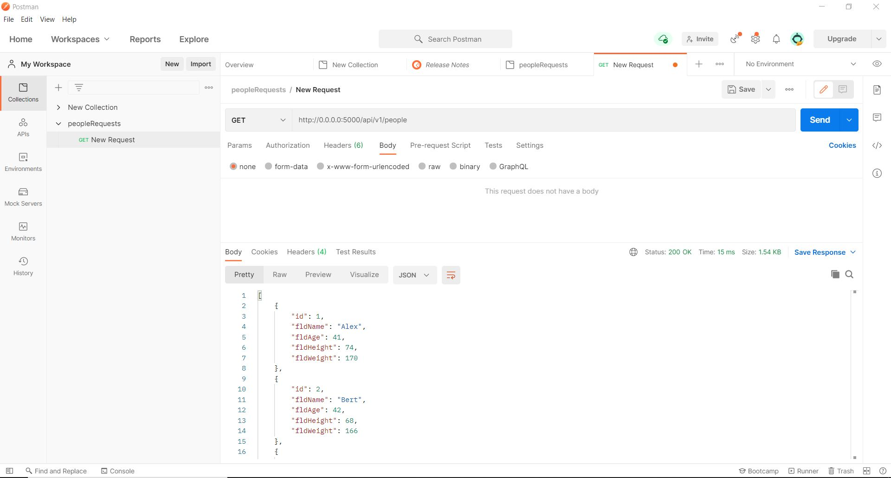
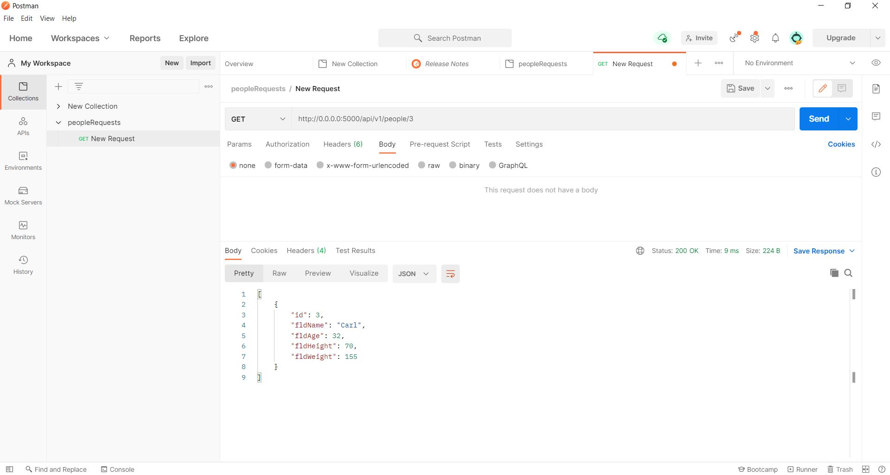
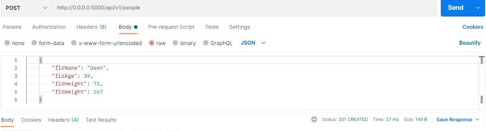
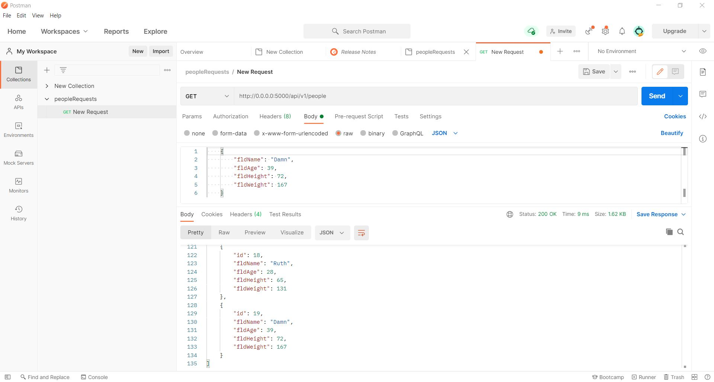
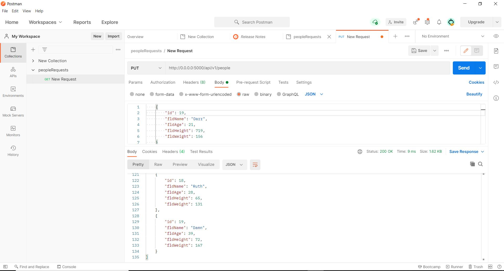
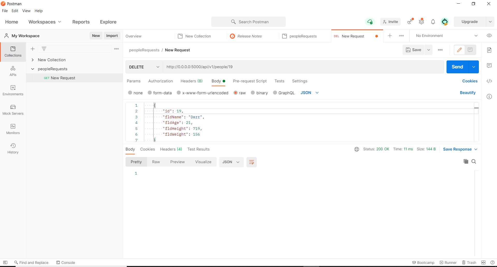

# PythonDockerFlaskSQL

This is my Final individual project for the IS601 course. In this project, I set up REST API with docker, flask, SQL and Postman 

## Postman GET- showing list of records in my database

## Postman GET- showing list of 1 record in my database

## Postman POST - Adding new record

### Screenshot of added record

## Postman PUT - Editing an existing record

### Screenshot of the edited record

## Postman DELETE - Deleting an existing record

### Screenshot after Deleting

