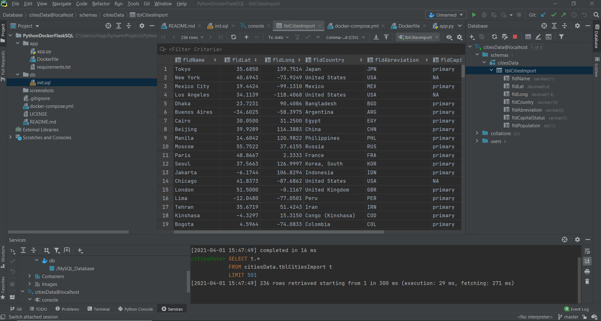
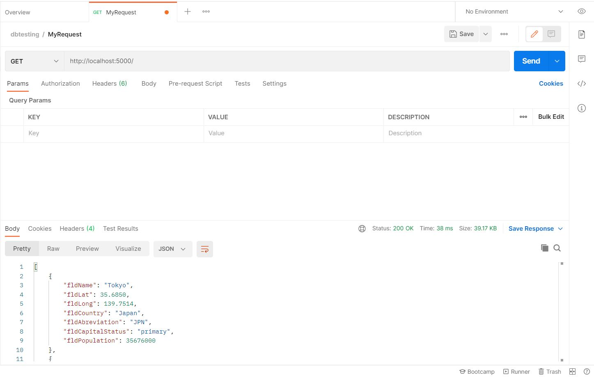

# PythonDockerFlaskSQL

This project is part of my homework assignment. This project taught me how to get Pycharm setup with Docker, Flask, MySQL, and Postman

## SQL Data Screenshot

## Postman Data Screenshot

