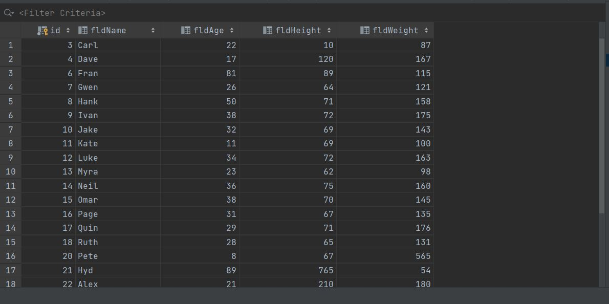
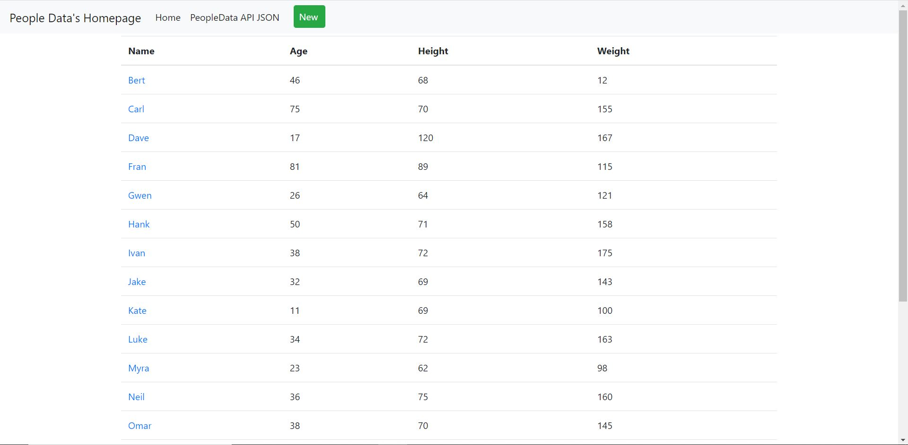
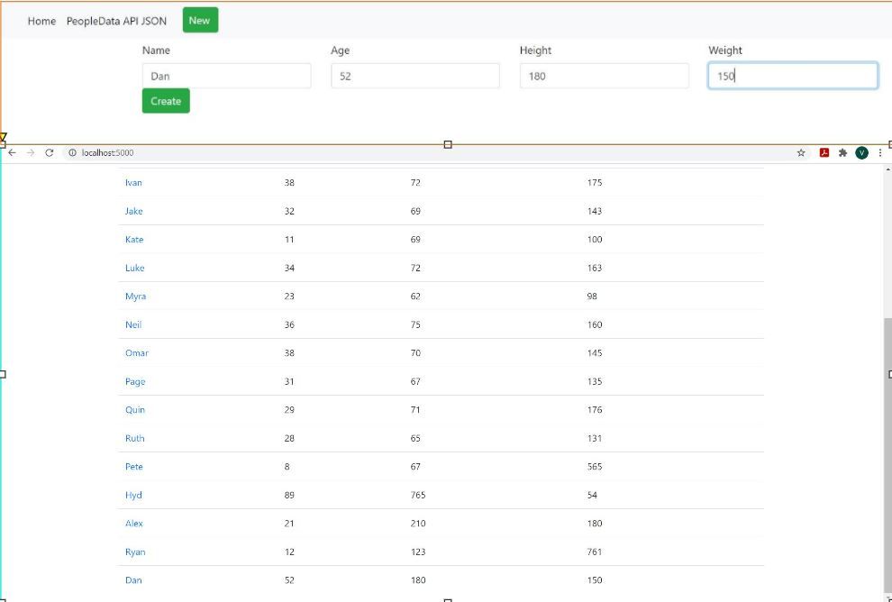
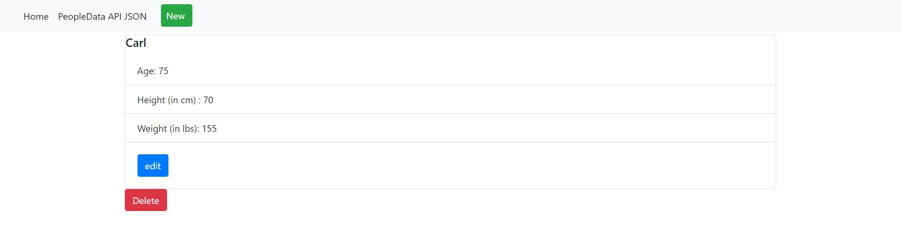
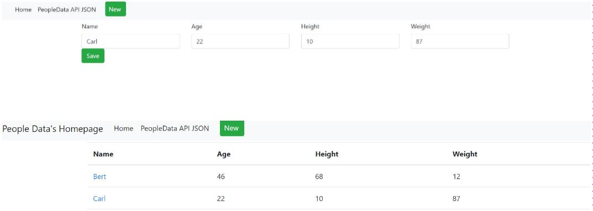
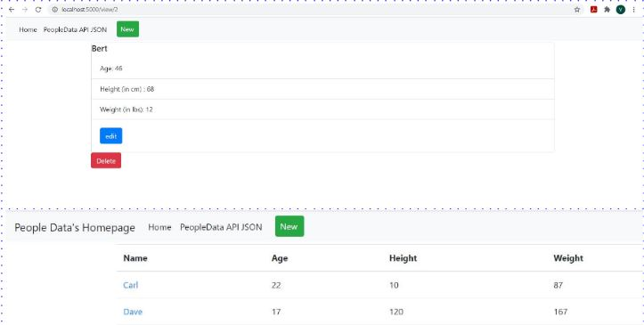

# PythonDockerFlaskSQL

This project is part of part 3 of my homework assignment. This project taught me how to make a webpage with Docker, Python, Flask and SQL.

## SQL Data Screenshot

## Webpage Screenshot

## Screenshot to add new items to database

## Screenshot to view an existing item

## Screenshot to edit an existing item

## Screenshot to delete an existing item

