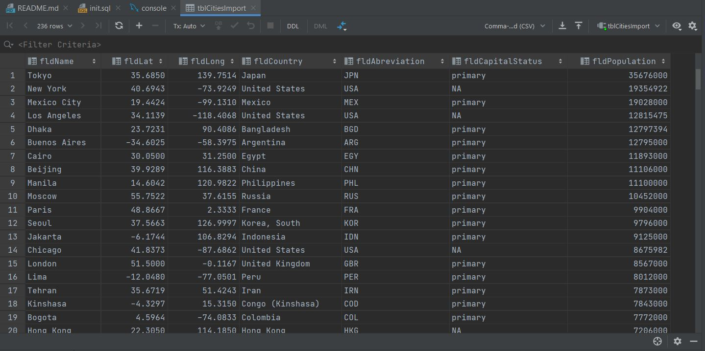

# PythonDockerFlaskSQL

This project is part2 of my homework assignment. This project taught me how to get Pycharm setup with Docker, Flask, MySQL, and Postman. It made me run the database using html and bootstrap template.

## Localhost Screenshot

## Postman Data Screenshot

## Database Screenshot

